# YouTube Cue Finder

YouTube 채널의 모든 영상에서 특정 단어나 구문이 포함된 지점을 찾아주는 웹 애플리케이션입니다.

## 🌟 핵심 기능 Key Features
- **채널 검색**: URL 또는 채널명으로 원하는 YouTube 채널을 쉽게 찾을 수 있습니다.
- **영상 필터링**: 채널의 모든 영상을 대상으로 특정 검색어가 포함된 영상만 필터링합니다.
- **타임스탬프 제공**: 검색어가 등장하는 모든 지점의 타임스탬프를 클릭 가능한 링크로 제공하여 바로 해당 장면으로 이동할 수 있습니다.

## 🏗️ 아키텍처 Architecture

```mermaid
graph TD;
    subgraph "User's Browser"
        A[React Client <br/> localhost:5173]
    end

    subgraph "Backend Services"
        B[Node.js Server <br/> localhost:3001]
        C[Python API <br/> localhost:5001]
    end
    
    subgraph "External APIs"
        D[YouTube Data API]
        E[YouTube Transcript API]
    end

    A -- "채널/영상 검색 요청" --> B;
    A -- "자막 검색 요청" --> C;
    B -- "채널/영상 정보 조회" --> D;
    C -- "자막 데이터 요청" --> E;
    
    B -- "검색 결과" --> A;
    C -- "자막 검색 결과" --> A;

    style A fill:#61DAFB,stroke:#000,stroke-width:2px
    style B fill:#8CC84B,stroke:#000,stroke-width:2px
    style C fill:#3776AB,stroke:#000,stroke-width:2px
    style D fill:#FF0000,stroke:#000,stroke-width:2px
    style E fill:#FF0000,stroke:#000,stroke-width:2px
```


## 🛠️ 설치 및 실행 Installation & Run

### 1. 사전 요구사항 Prerequisites
- **Node.js**: v18 이상
- **Python**: v3.11 이상

### 2. 프로젝트 클론 Clone the Project
```bash
git clone https://github.com/your-username/youtube-cue-finder.git
cd youtube-cue-finder
```

### 3. 환경 변수 설정 Set Environment Variables
Node.js 서버가 YouTube Data API를 사용하기 위해서는 API 키가 필요합니다.

1.  [Google Cloud Console](https://console.cloud.google.com/apis/credentials)에서 YouTube Data API v3 사용 설정을 하고 API 키를 발급받으세요.
2.  `server` 디렉터리에 `.env` 파일을 생성합니다.
    ```bash
    touch server/.env
    ```
3.  생성한 `.env` 파일에 발급받은 API 키를 다음과 같이 추가합니다.
    ```
    YOUTUBE_API_KEY=여기에_발급받은_API_키를_입력하세요
    ```

### 4. 서비스 종속성 설치 Install Dependencies
각 서비스 디렉터리에서 필요한 패키지를 설치합니다.

```bash
# Node.js 서버 종속성 설치
cd server && npm install && cd ..

# React 클라이언트 종속성 설치
cd client && npm install && cd ..

# Python 가상환경 설정 및 패키지 설치
cd python-api
python3 -m venv venv
source venv/bin/activate
pip install flask youtube-transcript-api flask-cors
cd ..
```

### 5. 서비스 시작 Start Services
프로젝트 루트 디렉터리에서 `start.sh` 스크립트를 사용하여 모든 서비스 또는 원하는 서비스만 선택적으로 실행할 수 있습니다.

```bash
# 모든 서비스 시작 (클라이언트, Node 서버, Python API)
./start.sh all

# React 클라이언트만 시작
./start.sh react

# Node.js 서버와 Python API만 시작
./start.sh node python
```

## 📡 API 엔드포인트 및 상태 확인 API Endpoints & Status

- **React Client**: `http://localhost:5173`
- **Node.js Server**: `http://localhost:3001`
  - `GET /api/health`: 서버 상태 및 YouTube API 키 유효성 검사. **(가장 먼저 확인해보세요!)**
  - `GET /api/channel-search`: 채널 검색 (URL 또는 이름)
  - `GET /api/channel-videos`: 채널의 모든 영상 목록 조회
  - `GET /api/check-transcript`: 자막 내 검색어 확인
- **Python API**: `http://localhost:5001`
  - `GET /health`: Python API 서버 동작 상태 확인
  - `POST /search`: 영상 목록을 받아 자막에서 검색어를 찾고 결과 반환
